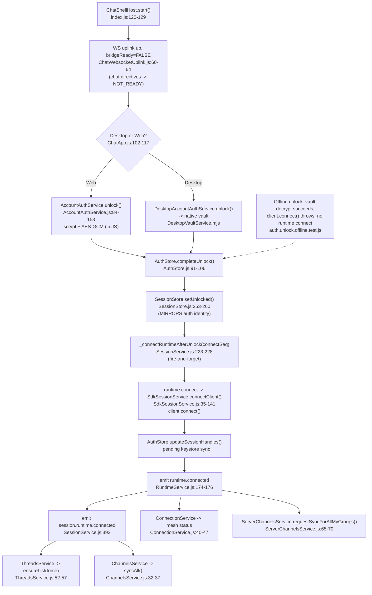
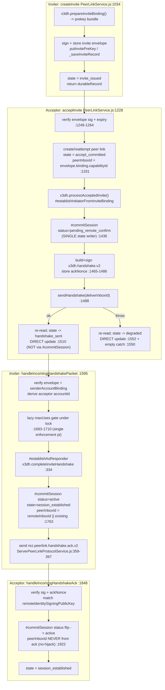
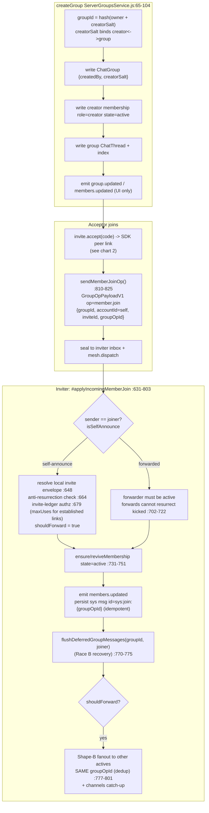

# Rez Flow Charts & Audit — 2026-06-07

Flow charts double as an audit vehicle for: **split brain** (one fact stored/derived in two
places that can disagree), **redundant pathing** (two code paths doing the same work), **races**,
**dead code / silent no-ops**, and repo-rule violations.

Scope traced: login/unlock, invite create/accept, group create/invite/accept, DM send/receive.
`file:line` references are against the v0.4.6 tree.

> **Confidence key:** ✅ verified by direct read this session · 🔶 reported by trace, plausible,
> not line-verified · ℹ️ design note (no action).

---

## 1. Login / Unlock / Account-select



### Findings — login/unlock
- **✅ SPLIT BRAIN (HIGH): `AuthStore` ⟷ `SessionStore` duplicate identity.** `AuthStore`
  (`AuthStore.js:19-24`) holds `accountId, deviceId, sessionHandles, accountList, selectedAccountId`;
  `SessionStore` mirrors all of these plus `localInboxId, ownerAccountId`. Two writers
  (`SdkSessionService` writes `sessionHandles` to AuthStore; `SessionService.setUnlocked` writes the
  session copy) can leave them stale relative to each other if the second write fails. Recommend a
  single canonical store (SessionStore as UI truth, AuthStore as read-only vault metadata).
- **🔶 REDUNDANT PATHING (MED): two reconcile triggers on different events.** `ThreadsService` /
  `ChannelsService` listen on `session.runtime.connected`; `ConnectionService` /
  `ServerChannelsService` listen on `runtime.connected`. Both events fire back-to-back from the same
  connect. `channels` sync is reachable from both the UI (`ChannelsService.syncAll`) and the server
  (`ServerChannelsService.requestSyncForAllMyGroups`) — risk of double `sync_request` fanout to peers.
  Pick one canonical trigger.
- **🔶 RACE (MED): `connectSeq` invalidation is timing-defensive.** `SessionService.js:223-228` fires
  connect without await; cancellation relies on comparing `connectSeq` against `_runtimeConnectSeq`
  (bumped by `lock()`). Works, but a real cancellation token would be sturdier than sequence compare.
- **🔶 SILENT (LOW): `takePendingServerSyncEnvelope()` always returns null on desktop** — the keystore
  sync branch in `SdkSessionService` is permanently dead for vault users. Correct by design (vault is
  authoritative); add a comment so it doesn't read as a bug.
- **ℹ️ rez-chat flow files are clean of optional chaining and empty catch.**

---

## 2. Invite — create & accept (1:1 peer link)



### Findings — invite
- **✅ ASYMMETRIC SOURCE-OF-TRUTH for `peerInboxId` (MED-HIGH).** Acceptor records the inviter's
  inbox from `envelope.binding.capabilityId` (`:1331`); inviter records the acceptor's inbox from the
  handshake's `senderInboxId` via `remoteInboxId || existing` (`:1763`). The ack path deliberately
  refuses to take it from the ack (`:1908-1922`, no-hijack) — but the *handshake* path has no such
  guard and **will overwrite** a previously-recorded inbox with a handshake-declared one. The inbox is
  authenticated to the sender's identity binding, so it's not a hijack, but it is a second, unguarded
  write site for a routing fact. Recommend: make `peerInboxId` write-once after first establish, or
  apply the same guard as the ack path.
- **✅ REDUNDANT PATHING / consolidation gap (MED): `acceptInvite` bypasses `#commitSession` for
  state-only transitions.** The Phase-2 goal was "one state writer," but `accept_committed` (`:1345/1359`),
  `handshake_sent` (`:1510`), and `degraded` (`:1552`) are written with direct `peerLinks.update/create`,
  not through `#commitSession`. These carry no ratchet, so it's defensible — but it's exactly the
  "multiple ways to establish" drift you dislike. Either route them through `#commitSession` (status-only
  mode already exists, used by the ack path) or document why these three are intentionally outside it.
- **✅ EMPTY CATCH (LOW, repo-rule): `PeerLinkService.js:1550`** `} catch { /* best effort */ }` on the
  handshake-attempt update in the send-failure path. CLAUDE.md bans silent catches; at minimum log it,
  and re-read like the ack path does.
- **🔶 RACE (MED): send-race re-read only checks `session_established`.** Both the success (`:1495`) and
  error (`:1533`) re-reads handle only the `session_established` jump; an interleaved reattempt landing
  in `accept_committed`/`degraded` isn't special-cased before the transition assert.
- **ℹ️ GOOD: maxUses enforcement is a single locked point** (`:1693-1710`), counts distinct acceptors,
  prekey retained until exhausted. ack version-conflict recovery (`:1927-1934`) is the correct
  duplicate-ack pattern. `_triggerRehandshake` silent-no-op is genuinely fixed in v0.4.6.

---

## 3. Group — create / invite / member-join



```mermaid
flowchart TD
    d0["inbound GROUP content\nServerEventService.js:254-299\nFAIL-CLOSED authz gate (audit pass 5 H1)"] --> d1{sender active member?}
    d1 -->|yes| d2["persist message (idempotent by messageId)"]
    d1 -->|no membership yet| d3["DEFER -> #deferredGroupMessages[groupId:sender]\nbounded 256 keys x 64 msgs :491-507"]
    d1 -->|removed/kicked| d4["DROP (no resurrection)"]
    d3 -. member.join arrives .-> d5["flush re-applies via #handleMailboxDeposited\nguarded by #redeliveringDeferred (no re-defer loop)"]
    d5 --> d2
```

### Findings — group
- **✅ REDUNDANT line / duplicate method (LOW): `m.accountId || m.accountId`.** Identical no-op
  expression `String(m && (m.accountId || m.accountId) || "").trim()` appears at
  `ServerGroupsService.js:883` **and** `:934` — the `|| m.accountId` is dead (same property twice), and
  the two membership-finder bodies are copy-paste. Collapse to one helper; drop the dead `||`.
- **🔶 OVERLAP, but SAFE (analysed): defer-flush buffer vs. pipeline self-heal buffer.** Two independent
  in-memory buffers — `InboundDepositPipeline` retains *ciphertext* before a session exists;
  `ServerEventService` defers *plaintext* before a sender is active. They operate at different stages
  and don't feed each other. Re-delivery converges because persistence is **idempotent by `messageId`**.
  That idempotency is the *only* thing preventing double-write — flagged as a brittleness point: if
  `messageId` ever becomes non-deterministic, double-delivery returns.
- **ℹ️ GOOD: creator protection has no split brain.** Founder authority is derived from immutable
  `group.createdBy` (not the stored `role`), enforced on both inbound (`:552-559, :579-599`) and outbound
  (`:216-220, :258-267`) paths. `member.join` replaced the old `snapshot.groupId` side-channel cleanly.
  Re-delivered joins are idempotent via `sys:join:{groupOpId}`.
- **🔶 GOD CLASS (LOW): `ServerGroupsService` ~1011 lines, `ServerEventService` ~616 lines** mix CRUD +
  op-dispatch + authz + fanout + defer-buffer. Candidate extraction: `ServerGroupOpApplier`,
  `ServerGroupBroadcaster`, `ServerDeferredMessageBuffer`. Not blocking.
- **ℹ️ DROP NOTE:** deferred buckets evict FIFO past 64 msgs/sender silently — acceptable bound, but a
  silent cap (matches relay-DoS guardrail philosophy; consider a counter/log).

---

## 4. DM — send & receive

```mermaid
flowchart TD
    subgraph SEND
      s1["MessagesService.send()\nui/.../MessagesService.js:83\noptimistic msg status=pending"] --> s2["ServerMessagesService.sendMessage()\n:132 wrap ChatMessagePayloadV1\nrecordOutboundDeposit status=pending"]
      s2 --> s3["#deliverToThread() :526\nsdk.sealForPeer + mesh.dispatch"]
      s3 --> s4["PeerLinkService.encryptDirectMessage() :745\nratchet encrypt + advance + persist snapshot"]
      s4 --> s5["status sent/queued/failed :244-270\nemit message.status; track ackPending"]
    end

    subgraph RECV [push or catch-up -> ONE pipeline]
      p0["MailboxPushBridge.onMailboxDeposited / InboxCatchupService"] --> p1["InboundDepositPipeline.submit()\nserialized, fully-awaited :100"]
      p1 --> p2{ProcessedDepositLog.has?\n:197-215}
      p2 -->|yes| pack["ack + skip (alreadyProcessed)"]
      p2 -->|no| p3["ServerPeerLinkProtocolService.processDeposit() :43"]
      p3 --> p4["decryptDirectMessageAnyPeer() :906\nTRIAL decrypt across all peer links"]
      p4 -->|ok| p5["mark processed; applyUserMessage()\nServerEventService.js:62"]
      p4 -->|THREAD_NOT_READY| p6{exactly 1 recovery\ncandidate >= threshold?}
      p6 -->|yes| p7["_triggerRehandshake() :290-294"]
      p6 -->|no| p8["retain in self-heal buffer\nredrain when later deposit consumed :112-195"]
      p5 --> p9["upsertDepositedMessage status=delivered\n+ threadIndex.unreadSummary :350-378"]
      p9 --> p10["emit thread.index.updated; send delivery.ack"]
      p10 --> p11["ThreadsService incremental badge :236-261\nAND ensureList(force) on connect :52-57"]
    end

    s5 -. relay .-> p0
    p10 -. E2EE delivery.ack .-> ackflow["handleDeliveryAck -> status=delivered\nServerMessagesService.js:608-641"]
```

### Findings — DM
- **🔶 SPLIT BRAIN (MED): unread badge — incremental event vs. authoritative snapshot.** Badges update
  two ways: incremental `thread.index.updated` patches (`ThreadsService.js:236-261`, lossy if emitted
  before renderer ready / dropped on churn) and the authoritative `threads.list` snapshot via
  `ensureList({force})`. This is the exact regression fixed in v0.4.6 by the connect-time force-refetch
  (`:52-57`). Reconciliation now exists, but the dual source remains — the snapshot is the truth; the
  incremental path is an optimization that must never be trusted alone.
- **🔶 REDUNDANT counters (LOW): two rehandshake miss-counters.** `decryptDirectMessage` and
  `decryptDirectMessageAnyPeer` keep separate failure counts against the same threshold (3), so recovery
  can be triggered from either independently. Minor (possible double-trigger), not a correctness bug.
- **ℹ️ GOOD: double-delivery is prevented** by `ProcessedDepositLog` (dedup marked *after* successful
  decrypt) + idempotent `messageId` persistence; push and catch-up share one serialized pipeline.
  Self-heal buffer (Race A) and defer-flush (Race B) are bounded and converge. THREAD_NOT_READY
  recovery is correctly conservative (fires only on exactly-one eligible candidate).
- **ℹ️ delivery-ack threadId resolution is a best-effort fallback chain** (`ackPending` → queued →
  param). Acceptable; an out-of-order ack after a send-retry can be dropped silently.

---

## Cross-cutting

| # | Finding | Severity | Confidence | Location |
|---|---------|----------|-----------|----------|
| 1 | AuthStore ⟷ SessionStore duplicate identity (two writers) | HIGH | ✅ | AuthStore.js:19-24, SessionStore.js:253-260 |
| 2 | `peerInboxId` second unguarded write on handshake path | MED-HIGH | ✅ | PeerLinkService.js:1331 vs 1763 |
| 3 | `acceptInvite` state transitions bypass `#commitSession` | MED | ✅ | PeerLinkService.js:1345/1510/1552 |
| 4 | Empty catch on handshake-attempt update (repo-rule) | LOW | ✅ | PeerLinkService.js:1550 |
| 5 | Unread badge dual source (incremental vs snapshot) | MED | 🔶 | ThreadsService.js:52-57 vs 236-261 |
| 6 | Two reconcile triggers / channels double-sync | MED | 🔶 | ChannelsService.js:32 + ServerChannelsService.js:65 |
| 7 | `m.accountId \|\| m.accountId` dead `\|\|` + duplicate finder | LOW | ✅ | ServerGroupsService.js:883, 934 |
| 8 | God classes (ServerGroupsService, ServerEventService) | LOW | 🔶 | both files |
| 9 | Optional chaining in rez-sdk(64)/rez-core(51); **rez-chat clean** | LOW | ✅ | transport/connection/auth/e2ee (NOT flow files) |
| 10 | Idempotent-`messageId` is the sole double-delivery guard | watch | 🔶 | pipeline + defer-flush |

**Note on #9:** the SDK/core optional-chaining uses are a standing CLAUDE.md violation, but they sit in
lower-level transport/state-machine code — **none of the flow logic audited here uses `?.`**, and
rez-chat has zero. Worth a separate cleanup pass, not part of these flows.
